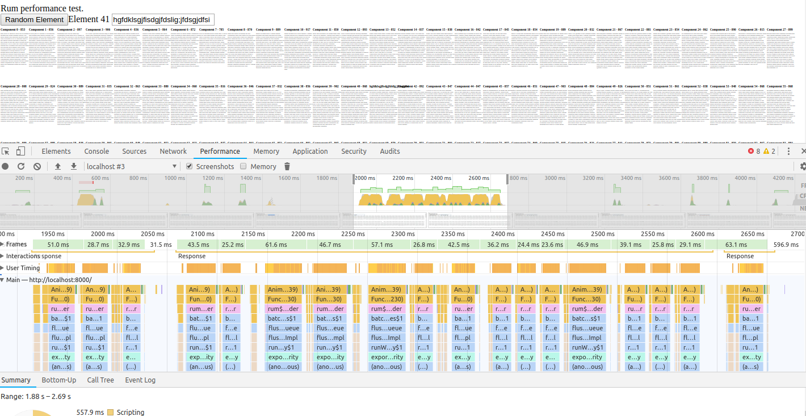
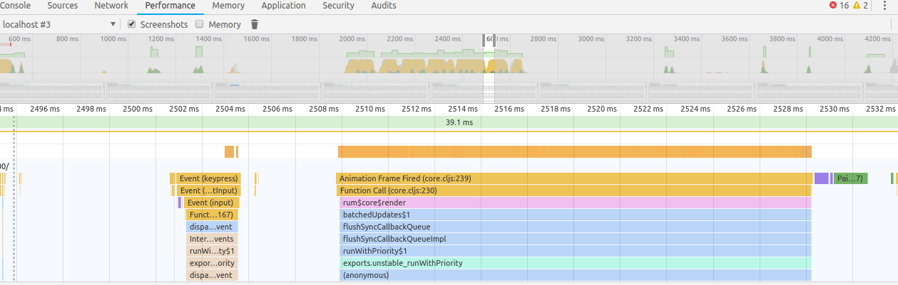
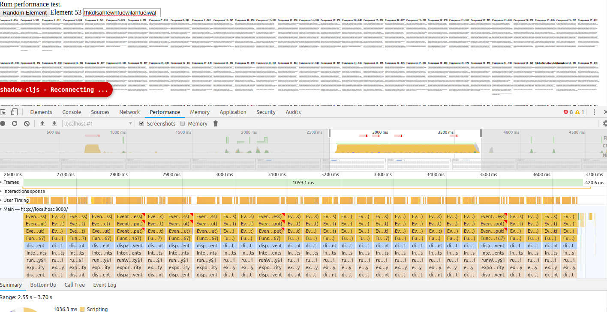
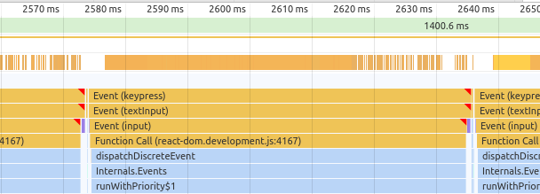

# Motivation

This project simply highlights a performance regression between Rum 0.11.5 and 0.12.3

# Prerequisites

You'll need `npm` installed - then run `npm install` on the project. `shadow-cljs` needs to work on the command line. See https://shadow-cljs.github.io/docs/UsersGuide.html#_installation if that doesn't work.

# Usage

## Rum 1.11.5

Run `shadow-cljs -d "rum:0.11.5" watch main` on the command line, and browse to `localhost:8000`.

Type in the input box at the top really rapidly and you'll see it respond fairly quickly to your input.

Chrome performance tests:

Zoom out view:

Zoom in view:

## Rum 1.12.3

Run `shadow-cljs -d "rum:0.12.3" watch main` on the command line, and browse to `localhost:8000`.

Type in the input box at the top really rapidly and you'll perceive a lag with the input response.

Chome performance tests:

Zoom out view:

Zoom in view:

#Conclusion

It seems that Rum 0.12.3 regressed in terms of asynchronous rendering, insisting on fully finishing up rendering update _before_ processing the next key event. This holds up the actual document rendering so that the input doesn't update until every keypress is processed which inflates the perceived performance regression even further.
